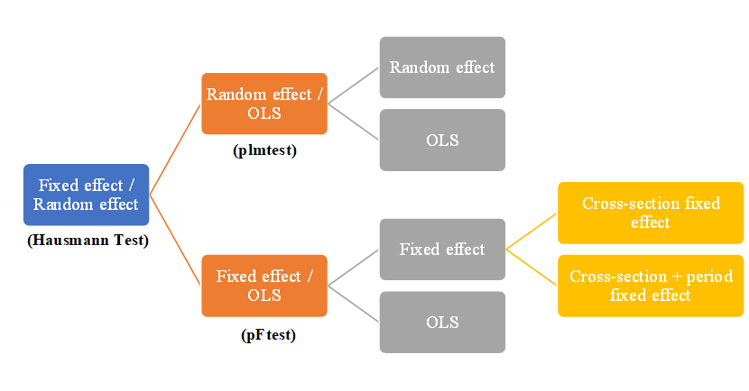

<style type="text/css">
  body{
  font-size: 13pt;
  text-align: justify;
}
.main-container {
  max-width: 1800px;
  margin-left: auto;
  margin-right: auto;
}
pre {
  font-size: 16px
}
</style>


```{r setup, include=FALSE}
knitr::opts_chunk$set(echo = TRUE)
library(reshape)
library("readxl")
library(dplyr)
library("MASS")
library("sandwich")
library("zoo")
library("car")
library("lmtest")
library("Formula")
library("plm")
library("stargazer")
library("aod")
library(ggplot2)
library(treemap)
library(RColorBrewer)
options(scipen=999)
setwd("C:/Users/Admin/Desktop/RR_FINAL-PROJECT/Data_set")
```

## 1. Introduction
- The project aims to reproduce Econometric Analyst in Advanced econometrics course in which I will investigate the nexus between **Corruption**  and **foreign direct investment (FDI)** in the context of a  panel data of the Middle East and North Africa (MENA) countries in period 2003-2009.
- For the project: **Reproduction** (2003-2009) -> **Replication** (extending the years 2003-2013) -> **Compare results**
- The econometrics model is inspired by paper [Heba E. Helmy (2013). The impact of corruption on FDI: is MENA an exception?](https://doi.org/10.1080/02692171.2012.752445)
- In general, there are two schools of thought on Corruption-FDI relationship: **"Grease"** versus **"sand"** theories:

|            | **Grease the wheel **                                                                                        | **Sand the wheel**                                                                      |
| ---------- | -------------------------------------------------------------------------------------------------------- | ----------------------------------------------------------------------------------- |
| Definition | Corruption allows economic agents to overcome the inefficiencies created by ill-functioning institutions | Corruption affects the performance of MNCs and is a disincentivizing factor for FDI |
| References | Lui (1985), Tullock (1996), Egger and Winner (2005).                                                     | Mauro (1995), Mo (2001), Chang and Hao (2017)                                       |                     |


## 2. Data Processing

### 2.1 Data description

| Variable                     | Abb     | Definition                                                                                | Source                               |
| ---------------------------- | ------- | ----------------------------------------------------------------------------------------- | ------------------------------------ |
| Foreign direct investment    | FDI     | Net FDI inflows into country                                                              | World Bank                           |
| Corruption perception index  | CPI     | Measure the corruption in each country. Range from 0 (highly corrupt) - 10 (highly clean) | Transparency International           |
| GDP per capita (current US$) | PCGDP   | Gross domestic product divided by midyear population                                      | World Bank                           |
| Openess                      | OPEN    | The value of exports plus the value of imports divided by GDP                             | World Bank                           |
| Fiscal Freedom               | FISCAL  | The tax burden imposed by government. Range from 0-100                                                     | Heritage’s Index of Economic Freedom |
| Investment Freedom           | FREEINV | The magnitude of constraints imposed by a country on the flow of investment capital. Range from 0-100       | Heritage’s Index of Economic Freedom |

### 2.2 Data Processing

- Originally, there are 21 MENA countries: Algeria, Bahrain, Egypt, Iran, Israel, Jordan, Kuwait, Lebanon, Libya, Morocco, Oman, Qatar, Saudi Arabia, Syria, Tunisia, United Arab Emirates, Yemen, Djibouti, Iraq, Palestine, Turkey. However, Yemen, Djibouti, Iraq, Palestine, Turkey are excluded in data due to the missing value for many years. $\checkmark$
- In most studies in the empirical literature on FDI flows, the logarithm for investment flows and the independent variables is used.Since some of the observations for FDI are negative, we transform these variables using the following procedure: $y = ln(x + \sqrt{x^2+1})$, where Y is a new observation obtained after transforming the initial negative observation x. $\checkmark$
- To avoid simultaneity, all explanatory variables are lagged one year in order with the dependent variable.$\checkmark$  
- <B><I>In orginal paper, Helmy (2013) used the fixed effects with cross-section weights estimation. However, the author did not clarify the weight parameters in the paper.</I></B> $\otimes$  

```{r echo=FALSE, message=FALSE, warning=FALSE}
MENA_DATA_1 <- read.csv(file = 'MENA_DATA_0309.csv')
MENA_DATA_0309 <- MENA_DATA_1[,c(-3,-10)]
MENA_PLOT <- MENA_DATA_1 %>% dplyr::group_by(Country) %>% dplyr:: summarise(CPI = mean(CPI), FDI = mean(FDI)) %>% arrange(CPI)
MENA_PLOT$Label <- paste(MENA_PLOT$Country, paste0(round(MENA_PLOT$FDI/1000000,2), ' Millions US$'), sep = "\n")
MENA_DATA_0313 <- read.csv(file = 'MENA_DATA_0313.csv')
MENA_DATA_0313 <- MENA_DATA_0313[,c(-3,-10)]
```

```{r, echo=FALSE, message=FALSE, warning=FALSE }
head(MENA_DATA_0309,10)
```


## 3. Regression on Panel Data Model

### 3.1 Descriptive statistic

```{r, echo=FALSE, message=FALSE, warning=FALSE, fig.height = 8, fig.width = 8, fig.align = "center"}
treemap(MENA_PLOT, 
        index=c("Label"), 
        vSize = "FDI",
        vColor  = "CPI",  
        type = "value",
        palette = "RdYlGn", 
        mapping = c(25,45,65),
        title="FDI-Corr nexus", 
        title.legend = "CPI",
        fontsize.title = 14 )
```

- As can be seen, the country with the lowest corruption level (highest score) among the 16 countries in the figure is Israel, followed closely by United Arab Emirates and Qatar.  On the contrary, Libya and the Iran are at the bottom. There is an obvious gap between these countries, the score of the first one being 65, while Libya only gained 23. <br>
- For the annual mean FDI inflows to the MENA countries, Saudi Arabia came to the top with 21714 Millions US in net FDI inflow . In the top countries which have high corruption index (>70), UAE and Israel  showed a good performance as well with 9015 and 7640 Millions US respectively. To our surprise, the net FDI inflow in Egypt and Lebanon, which gained low scores on the corruption index, is higher than some cleaner countries such as Oman, Bahrain. <br> 

### 3.2 Panel data model

- **The process of using Panel data Model**

```{r pressure, echo=FALSE, fig.cap="The process of using Panel data Model", out.width = '100%',fig.align='center'}

```

- **Main model**

$$ LNFDI =   \beta_{0i,t} +  \beta_1LNCPI_{i,t-1} +  \beta_2LNPCGDP_{i,t-1} +  \beta_3OPEN_{i,t-1} +  \beta_4FISCAL_{i,t-1} + \beta_5FREEINV_{i,t-1} +  \mu_i +  \lambda_t + \epsilon_{i,t} $$
 In which: <br> 
  - LNFDI: dependent variable <br>
  - LNCPI, LNPCGDP, OPEN, FISCAL, FREEINV: independent and control variables <br>
  - $\mu_i$: the unobservable individual effect <br>
  - $\lambda_t$: the unobservable time effect <br>
  - $\epsilon_{i,t}$: a random disturbance <br>

- **Selecting appropriate model**
<br>

<style>
   table {
            border: 5px double black;
   }
   th {
            border-bottom: 1px solid black;
   }
</style>
<table style="width:120%">
    <tr>
        <th rowspan="2", style="text-align:center; font-weight: bold">Variable</th>
        <th colspan="3", style="text-align:center; font-weight: bold">MENA 2003-2009</th>
        <th colspan="2", style="text-align:center; font-weight: bold">MENA 2003-2013</th>
    </tr>
    <tr>
        <th><I>Hausmann Test</I></th>
        <th><I>pFtest</I></th>
        <th><I>pFtest</I></th>
        <th><I>Hausmann Test</I></th>
        <th><I>pmltest</I></th>
    </tr>
    <tr>
        <td>Syntax</td>
        <td>phtest(fixed, random)</td>
        <td>pFtest(fixed, OLS)</td>
        <td>pFtest(fixed_2, fixed_1)</td>
        <td>phtest(fixed, random)</td>
        <td>plmtest(OLS, type=c("bp"))</td>
    </tr>
    <tr>
        <td>p-value</td>
        <td><B>0.03**</B></td>
        <td><B>0.06*</B></td>
        <td><B>0.07*</B></td>
        <td>0.16</td>
        <td>0.53</td>
    </tr>
    <tr>
        <td style="text-align:left">alternative hypothesis</td>
        <td style="text-align:left">one model is inconsistent</td>
        <td style="text-align:left">significant effects</td>
        <td style="text-align:left">significant effects</td>
        <td style="text-align:left">one model is inconsistent</td>
        <td style="text-align:left">significant effects</td>
    </tr>
</table>

<br>

- **Results**
<br>

<style>
   table {
            border: 5px double black;
   }
   th {
            border-bottom: 1px solid black;
   }
</style>
<table style="width:120%">
    <tr>
        <th rowspan="3", style="text-align:center; font-weight: bold"> Variable </th>
        <th colspan="4", style="text-align:center; font-weight: bold"> Heba E. Helmy (2013) </th>
        <th colspan="4", style="text-align:center; font-weight: bold"> Reproduce (2003-2009) </th>
        <th colspan="2", style="text-align:center; font-weight: bold"> Replication (2003-2013) </th>
    </tr>
    <tr>
        <th colspan="2", style="text-align:center"> <I>Fixed effect(1)</I></th>
        <th colspan="2", style="text-align:center"> <I>Fixed effect(2)</I></th>
        <th colspan="2", style="text-align:center"> <I>Fixed effect(1)</I></th>
        <th colspan="2", style="text-align:center"> <I>Fixed effect(2)</I></th>
        <th colspan="2", style="text-align:center"> <I>OLS</I></th>
    </tr>
    <tr>
        <th style="text-align:center">Estimate</th>
        <th style="text-align:center">P-value</th>
        <th style="text-align:center">Estimate</th>
        <th style="text-align:center">P-value</th>
        <th style="text-align:center">Estimate</th>
        <th style="text-align:center">P-value</th>
        <th style="text-align:center">Estimate</th>
        <th style="text-align:center">P-value</th>
        <th style="text-align:center">Estimate</th>
        <th style="text-align:center">P-value</th>
    </tr>
    <tr>
        <td style="text-align:center">LNCPI</td>
        <td style="text-align:center"><B>-0.32</B></td>
        <td style="text-align:center">0.00***</td>
        <td style="text-align:center"><B>-0.3</B></td>
        <td style="text-align:center">0.06*</td>
        <td style="text-align:center"><B>-13.5</B></td>
        <td style="text-align:center">0.027**</td>
        <td style="text-align:center"><B>-19.2</B></td>
        <td style="text-align:center">0.00***</td>
        <td style="text-align:center">-0.84</td>
        <td style="text-align:center">0.72</td>
    </tr>
    <tr>
        <td style="text-align:center">LNPCGDP</td>
        <td style="text-align:center"><B>1.42</B></td>
        <td style="text-align:center">0.00***</td>
        <td style="text-align:center"><B>1.73</B></td>
        <td style="text-align:center">0.02**</td>
        <td style="text-align:center">0.58</td>
        <td style="text-align:center">0.84</td>
        <td style="text-align:center"><B>13.45</B></td>
        <td style="text-align:center">0.07*</td>
        <td style="text-align:center">0.19</td>
        <td style="text-align:center">0.77</td>
    </tr>
    <tr>
        <td style="text-align:center">OPEN</td>
        <td style="text-align:center"><B>0.03</B></td>
        <td style="text-align:center">0.00***</td>
        <td style="text-align:center"><B>0.02</B></td>
        <td style="text-align:center">0.07*</td>
        <td style="text-align:center">0.04</td>
        <td style="text-align:center">0.57</td>
        <td style="text-align:center">0.16</td>
        <td style="text-align:center">0.12</td>
        <td style="text-align:center"><B>0.05</B></td>
        <td style="text-align:center">0.04**</td>
    </tr>
    <tr>
        <td style="text-align:center">FISCAL</td>
        <td style="text-align:center"><B>-0.02</B></td>
        <td style="text-align:center">0.06*</td>
        <td style="text-align:center">-0.01</td>
        <td style="text-align:center">0.43</td>
        <td style="text-align:center">-0.04</td>
        <td style="text-align:center">0.65</td>
        <td style="text-align:center">-0.03</td>
        <td style="text-align:center">0.71</td>
        <td style="text-align:center"><B>-0.08</B></td>
        <td style="text-align:center">0.04**</td>
    </tr>
    <tr>
        <td style="text-align:center">FREEINV</td>
        <td style="text-align:center">0.00</td>
        <td style="text-align:center">0.70</td>
        <td style="text-align:center">0.00</td>
        <td style="text-align:center">0.60</td>
        <td style="text-align:center"><B>-0.14</B></td>
        <td style="text-align:center">0.04**</td>
        <td style="text-align:center"><B>-0.18</B></td>
        <td style="text-align:center">0.01**</td>
        <td style="text-align:center">0.01</td>
        <td style="text-align:center">0.69</td>
    </tr>
    <tr>
        <td style="text-align:center">Obeservation</td>
        <td colspan="2", style="text-align:center">96</td>
        <td colspan="2", style="text-align:center">96</td>
        <td colspan="2", style="text-align:center">96</td>
        <td colspan="2", style="text-align:center">96</td>
        <td colspan="2", style="text-align:center">160</td>
    </tr>
    <tr>
        <td style="text-align:center">R-squared</td>
        <td colspan="2", style="text-align:center">0.99</td>
        <td colspan="2", style="text-align:center">0.9</td>
        <td colspan="2", style="text-align:center">0.15</td>
        <td colspan="2", style="text-align:center">0.26</td>
        <td colspan="2", style="text-align:center">0.05</td>
    </tr>
    <tr>
        <td style="text-align:center">F-statistic</td>
        <td colspan="2", style="text-align:center"> 300.67***</td>
        <td colspan="2", style="text-align:center"> 22.46***</td>
        <td colspan="2", style="text-align:center"> 2.58**</td>
        <td colspan="2", style="text-align:center"> 2.51**</td>
        <td colspan="2", style="text-align:center"> 1.5</td>
        
    </tr>
</table>

**Note**: **i)** `***`Significant at 1% level, `**`Significant at 5% level, `*`Significant at 10% level. **ii)** Helmy (2013) use CPI, while in reproduction and replication model, LNCPI is used. **iii)** Fixed effect (1) is cross-section fixed effect, Fixed effect (2) is cross-section + period fixed effect.

### 3.3 Discussion

* <B>In Reproduction model:</B> <br>
  - Two variables (CPI and FREEINV) proved significant at the 5% confident level or lower. In additional, LNPCGDP is significant at 10% confident level while using cross-section + period effect model.
  - Focusing on the main explanatory variable, the CPI shows a negative relationship exists between transparency and foreign direct investment, as a 1% increase in CPI (more transparency) decrease FDI inflows in MENA countries 13.5% when using Fixed effect (1) model, and 19.2% when using Fixed effect (2) model => **support "Grease the wheel" theory **.
  - The results shows the impact of FREEINV, indicated that a 1-point increase in FREEINV decrease FDI flows by 14-18%.
  - Finally, in fixed effect (2) model, the GDP per capita as evident by the LNPCGDP indicator proved to have a significant and positive coefficient.
* <B>In Replication model:</B> <br>
  - LNCPI is insignificant in model.
  - The openness of country (OPEN) proved to have a significant and positive correlation while fiscal freedom (FISCAL) proved to have a significant and negative correlation.  

## 4. Conclusion

- Corruption in MENA does not discourage investors. More than that, corruption is a means of economic expansion by overcoming bad and restrictive laws or behavior such that the value of economic expansion surpasses the extra costs of corruption, thereby supporting the efficient grease hypothesis (Helmy, 2003).
- Period time of investigation is vital. It can change the results of the model.

## Appendix

- Fixed effect model (2003-2009)
```{r, echo=FALSE, message=FALSE, warning=FALSE}
fixed_0309 <-plm(LNFDI~LNCPI+LNPCGDP+OPEN+FISCAL+FREEINV, data=MENA_DATA_0309, index=c("Country",'year'), model="within")
summary(fixed_0309)
```

- Random effect model (2003-2009)
```{r, echo=FALSE, message=FALSE, warning=FALSE}
random_0309 <-plm(LNFDI~LNCPI+LNPCGDP+OPEN+FISCAL+FREEINV, data=MENA_DATA_0309, index=c("Country",'year'), model="random")
summary(random_0309)
```

- Fixed effect (cross-section + period) (2003-2009)
```{r, echo=FALSE, message=FALSE, warning=FALSE}
fixed.time_0309 <-plm(LNFDI~LNCPI+LNPCGDP+OPEN+FISCAL+FREEINV + factor(year), data=MENA_DATA_0309, index=c("Country", "year"), model="within")
summary(fixed.time_0309)
```

- OLS model (2003-2009)
```{r, echo=FALSE, message=FALSE, warning=FALSE}
OLS_0309 <-plm(LNFDI~LNCPI+LNPCGDP+OPEN+FISCAL+FREEINV, data=MENA_DATA_0309, index=c("Country", "year"), model="pooling")
summary(OLS_0309)
```

- Hausman test for Random and Fixed effect model (2003-2009)
```{r, echo=FALSE, message=FALSE, warning=FALSE}
phtest(fixed_0309, random_0309)
```

- pFtest for Fixed effect and OLS model (2003-2009)
```{r, echo=FALSE, message=FALSE, warning=FALSE}
pFtest(fixed_0309, OLS_0309)
```

- pFtest for Fixed effect and OLS model (2003-2009)
```{r, echo=FALSE, message=FALSE, warning=FALSE}
pFtest(fixed.time_0309, fixed_0309)
```

----

- Fixed effect model (2003-2013)
```{r, echo=FALSE, message=FALSE, warning=FALSE}
fixed_0313 <-plm(LNFDI~LNCPI+LNPCGDP+OPEN+FISCAL+FREEINV, data=MENA_DATA_0313, index=c("Country",'year'), model="within")
summary(fixed_0313)
```

- Random effect model (2003-2013)
```{r, echo=FALSE, message=FALSE, warning=FALSE}
random_0313 <-plm(LNFDI~LNCPI+LNPCGDP+OPEN+FISCAL+FREEINV, data=MENA_DATA_0313, index=c("Country",'year'), model="random")
summary(random_0313)
```

- Fixed effect (cross-section + period) (2003-2013)
```{r, echo=FALSE, message=FALSE, warning=FALSE}
fixed.time_0313 <-plm(LNFDI~LNCPI+LNPCGDP+OPEN+FISCAL+FREEINV + factor(year), data=MENA_DATA_0313, index=c("Country", "year"), model="within")
summary(fixed.time_0313)
```

- OLS model (2003-2013)
```{r, echo=FALSE, message=FALSE, warning=FALSE}
OLS_0313 <-plm(LNFDI~LNCPI+LNPCGDP+OPEN+FISCAL+FREEINV, data=MENA_DATA_0313, index=c("Country", "year"), model="pooling")
summary(OLS_0313)
```

- Hausman test for Random and Fixed effect model (2003-2013)
```{r, echo=FALSE, message=FALSE, warning=FALSE}
phtest(fixed_0313, random_0313)
```

- plmtest for Random effect and OLS model (2003-2013)
```{r, echo=FALSE, message=FALSE, warning=FALSE}
plmtest(OLS_0313, type=c("bp"))
```
